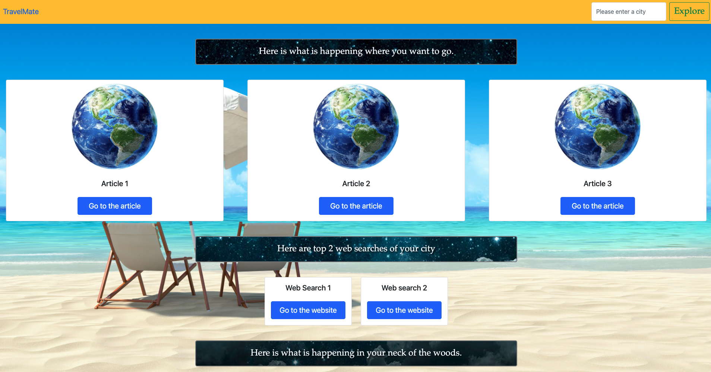
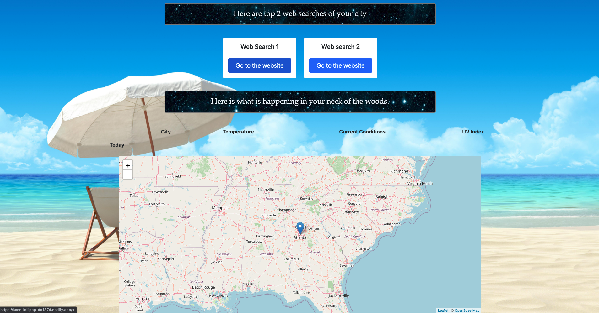

Explanation of what the project is / what it does.
TravelMate is a web application desinged for the amatuer traveler. It provides basic information such current web and news events, weather data, and location of a specific destination you would like to visit.

What technologies you used.
-Bootstrap
-JS Library - Leaflet
-Deployment -Netlify
-API - Webit Web Search, Weather Api
-HTML
-Javascript
-CSS

Screenshots of your project.

List of team members.
-Sam Moon

-Victor Hutton Brew

-Rocky Rosaless

